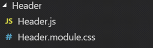

# React Task 1

## Deadline: 07.04

### Task:

- Build simple layout using components with React, which are: **header, content (main section) and footer**.

- Create store variable and pass it down to components using props.


### Requirements

- use **create-react-app** as a boilerplate for your application (this one is optional, you can create your own Webpack config)

- in your project please follow suggested folder structure: (here you can also find your own way on how to make a decent folder structure, this is just my proposal)


**index.js** file should just import the ```<App />``` component and simply call the ```ReactDOM.render method```. Also you need to store a variable here called **store**. This variable should be an object with required fields: **user** (contains **firstName** and **lastName**) and **avatar** (contains **url** and **alt**).

**index.css**(index.module.scss/index.scss) should just contain all the **basic styles** for your app (like rules for html, body)


Each React component should have its own folder with the jsx and relevant stylesheets

for example




Then you need to find a way on how to pass the store value through an App component to use this store value in a child components (Header, Content). Footer Component can be hardcoded for now.


Here is the diagram which explains basic data flow


### Optional tasks

- use SCSS as a preprocessor

- use CSS modules

- create an additional index.js file for each component which will just re-export your component. This is always done to make the import shorter (no hints here, try to research it by yourself)


**You can use yarn or npm. It's your choice**


# React task 2 

## Deadline: 16.04 

 

### Task: 
Create two additional components and render them in <Main /> component. One component should be written as a class, and should have state and proper lifecycle methods (e.g. <CardsContainer />). This component should fetch the data, update its own state and then map this state to a presentational child component (e.g. <Card />). 

 

**_Steps which should be covered:_**

1) Create an additional folder in your project’s root directory which will be called __api__. 

This folded should contain 2 files: __mockedResponse.js__, and __mockedApi.js__ 


2) __mockedResponse.js__ file should just contain one variable, which will be an array of objects (make 6-8 objects with optional fields). For example:


 

3) the __mockedApi.js__ file contains function, which will return a resolved promise with __mockedResponse__ data 

 

4) in your project’s __‘src’__ folder create an additional folder called __‘components’__ and move all components there (you imports might need to be updated accordingly). 

The result should be something similar


 

5) In your __components__ folder create an additional folder which will be called __Cards__. 

__This folder should contain 2 files for 2 components: `<CardsContainer/>` and `<Card />` and related CSS-files for each of them.__

Note: `<CardsContainer />` is a class component and it should have state and proper lifecycle methods. `<Card />` component is just a pure functional component which just should accept several props and render them in a simple card with image and description (design of the card is up to you) 

6) `<CardsContainer/>` should fetch the data from our mockedApi and update it’s own state. After it the actual state should be mapped to a `<Card />` component. (don’t forget about key property)  

 

7) ___If there is no cards yet render a fallback JSX___ like `<div>No cards yet</div>`